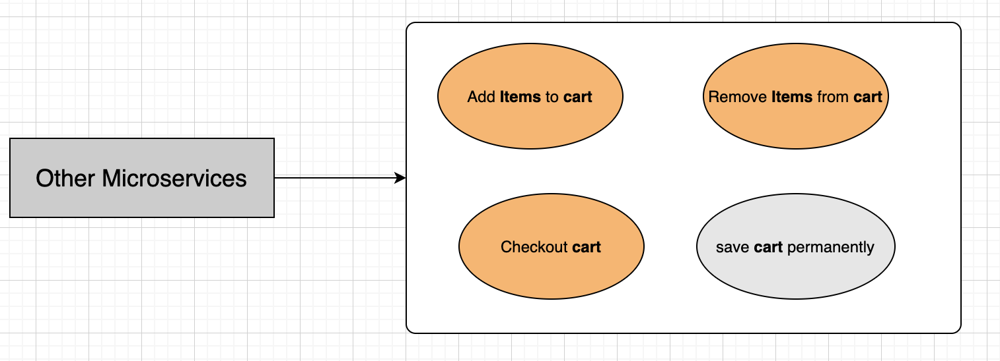
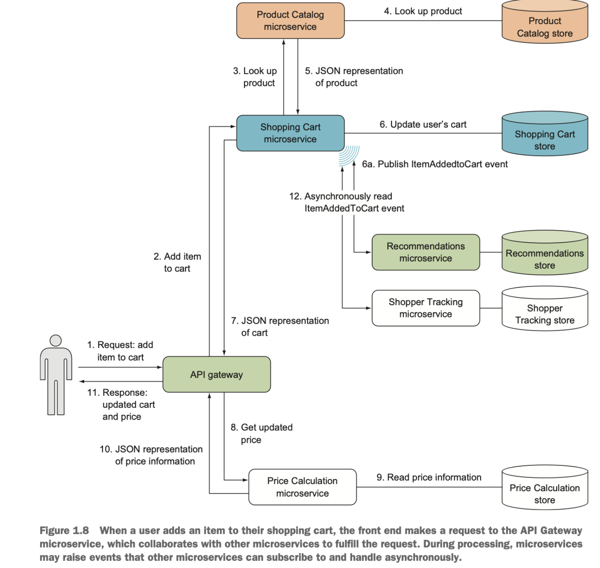
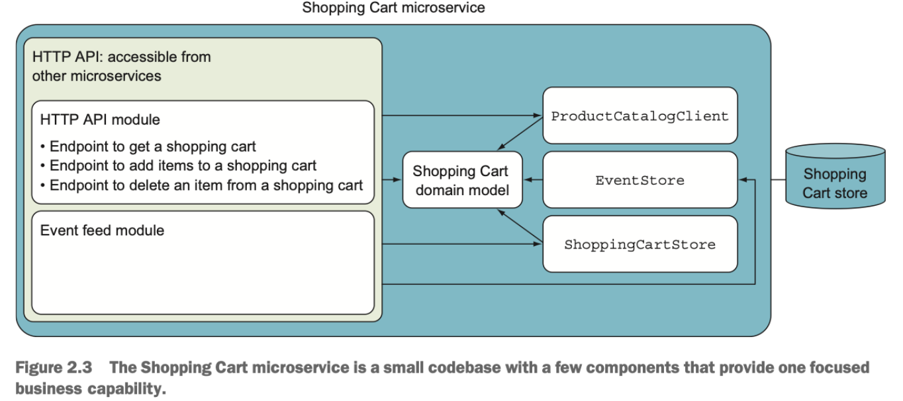
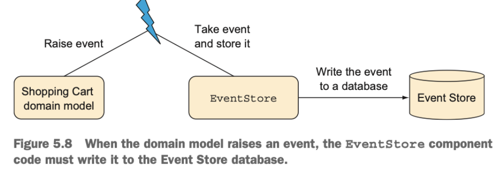
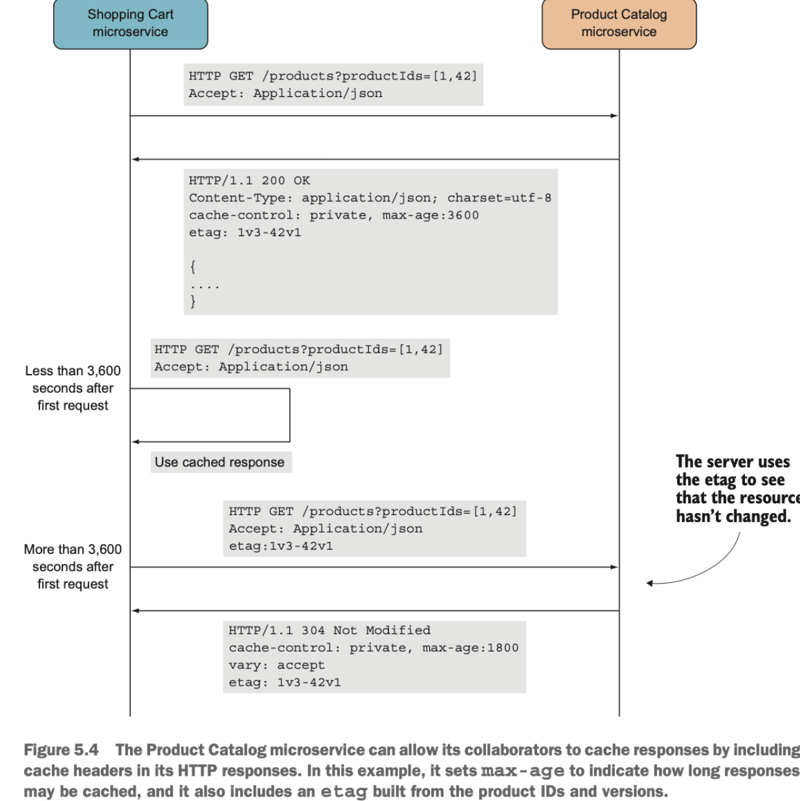

# ShoppingCartService

> Business Capabilities
>
> Each user has his/her owned shopping cart. The shopping cart will be saved as long as the user not checkout.
>
> User can add/remove items from shopping cart. These action will be tracked for `recommendation` and `shopper tracking` perpose.



## Setup

## Deploy

## Service Information

```sh
 Dev Machine Url : http://localhost:5000
 Port:5000
```





### Endpoints

| Name          | Url            |
| ------------- | -------------- |
|               |                |
| Shopping Cart | /shoppingcart/ |
| Events        | /events/       |

### Event Feed

| Name                      | Description                              |
| ------------------------- | ---------------------------------------- |
|                           |                                          |
| ItemsAddedToCartEvent     | happend when user add items into cart    |
| ItemsRemovedFromCartEvent | happend when user remove items from cart |

## Ownership of data

### Central Database Store Procedure

Shopping Cart

```sh
 Name:
 Params:
 Result:
```

EventStore

```sh
 Name:
 Params:
 Result:
```

### Read-Optimizing Database Store Procedure

Shopping Cart

```sh
 Name:
 Params:
 Result:
```

EventStore

```sh
 Name:
 Params:
 Result:
```

### Event Store



## Locality of data

### Catching

> The purpose of caching:
>
> -   To eliminate the need, in many cases, to request information the caller already has
>
> -   To eliminate the need, in many other situations, to send full HTTP responses



### Mirror data

> Replacing a query to another microservice with a query to the microservice’s own database by creating a `read model`: a data model that can be queried easily and efficiently.
>
> Read models are often based on **events** from other microservices.
>
> Read models can also be built from **responses to queries** to other microservices
